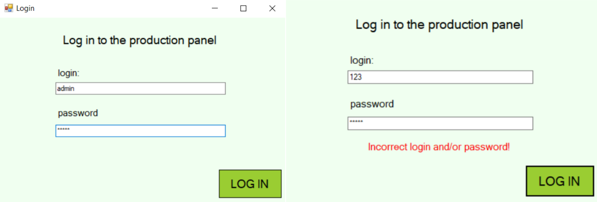

# Production line simulator
## Table of contents
* [Description](#description)
* [Overview](#overview)
* [Technologies](#technologies)

## Description
The application contains elements of diagnostics supervised “production process” as well as self-diagnosis of the watchful operator over the correct course of the “production”. The production line simulator is a pizza factory.

* The program includes a login window to log in to the production line simulator.
* The dispatcher can change the production paramters such as:
  - speed of the coveyor belt 
  - size of the pizza dough
  - oven temperature
  - active ventilators
* The application constantly checks the presence and "consciousness" of the operator. The self-diagnostic element consists message informing that the presence must be confirmed by pressing a confirm activity-button. If there is no confirmation after the timeout, ana alarm is triggered and the operator is logged out of the system. 
* Current production parameters and CPU uage are monitored. 
* The program randomly generates a failure. If the dispatcher does not follow the given instructions privided to fix the failure then the warehouse will burn and the dispatcher will be logged out of the system.

## Overview
* Login window:

* Production line simulator:

## Technologies
Project is created with Windows Forms C#.